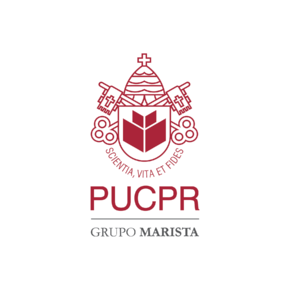
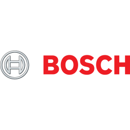

# Desenvolvimento de Software (C# / SQL Server / Angular) 
# 

<ul>
<li>Repositório contendo exercícios e atividades do curso de Desenvolvimento de Software ministrado pela PUC com apoio da Bosch.
<li>Os exercícios são dividos pelos assuntos abordados
</ul>
<h1>C#</h1>
<ol>
<li>Conceitos Iniciais - Contém exercícios com conceitos iniciais. Por motivos diáticos não há preocupação com tratamento de exceções.
</ol>

